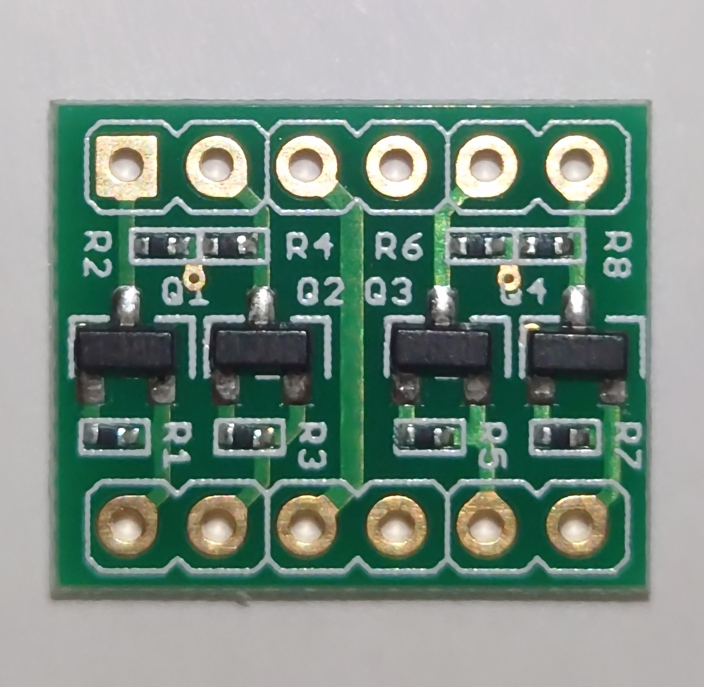
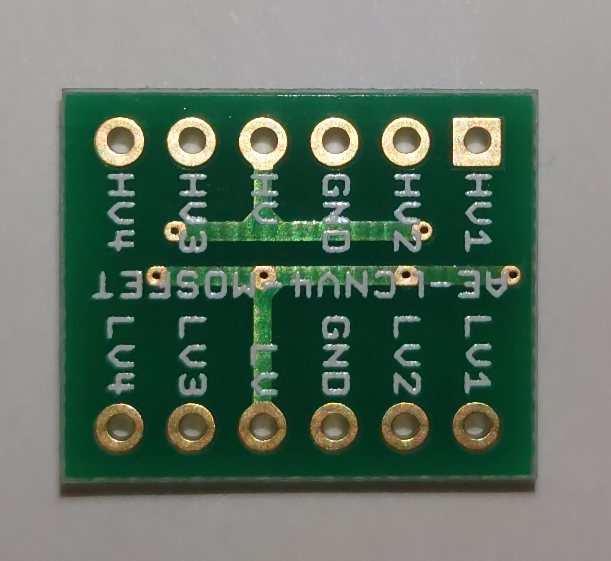

# テスト済みコンポーネント一覧

このページには、本基板でテスト済みのコンポーネントが掲載されています。このページは、私の個人的なテスト結果とコミュニティからのデータに基づいています。

## Raspberry Pi Pico

理論上は、同じピン配置を持つすべてのRaspberry Pi Picoクローンで動作するはずです。

| 互換性 | 画像 | 販売店/データシート | 説明 |
| - | - | - | - |
| あり |  | [リンク](https://www.raspberrypi.com/products/raspberry-pi-pico/) | 本家 Raspberry Pi Pico |
| あり |  | [リンク](https://www.raspberrypi.com/products/raspberry-pi-pico/) | 本家 Raspberry Pi Pico W |
| あり |  | [リンク](https://www.aliexpress.com/item/1005003928558306.html) | RP2040 Lite Black TYPE-C 4M |

## レベルシフタ

質の悪いクローン製品には注意してください。

| 互換性 | 画像 | 販売店/データシート | 説明 |
| - | - | - | - |
| あり |   | [sparkfun](https://www.sparkfun.com/products/12009) | Sparkfun製 4チャンネルレベルシフター |
| あり |   | | |
| あり |   | [Amazon US](https://www.amazon.co.jp/-/en/gp/product/B0CL2R6K26/) | |
| なし |   | [Amazon US](https://www.amazon.co.jp/-/en/gp/product/B081RH1P4L) | 薄く、低品質な基板 |
| あり（未検証） |   | [秋月電子 販売コード:113817](https://akizukidenshi.com/catalog/g/g113837/) | 他とは違い、裏返して本体基板に実装する点に注意 |
