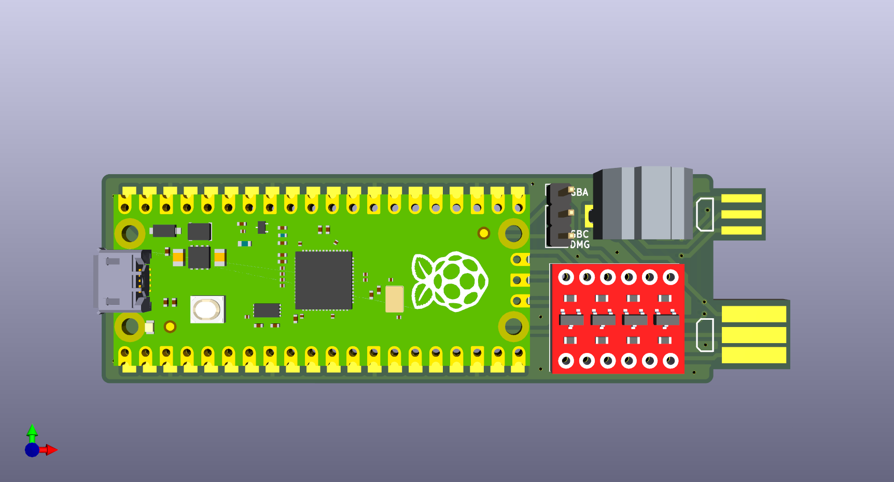
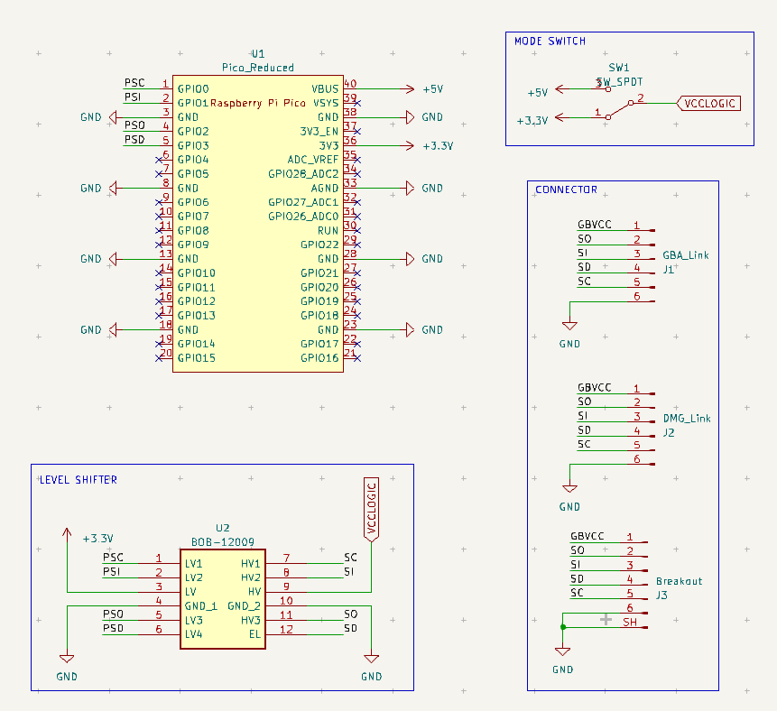

# USB TO GAMEBOY LINK CABLE ADAPTER

フォーク元の基板にGBA用通信ポートを追加しました、基板を傷めずに接続できます。  
以下はフォーク元のREADMEを追記・修正して作成しています

ライセンスは自作した[libraries/gba_linkport Libraries](libraries/gba_linkport%20Libraries)内のみ[CC0](http://creativecommons.org/publicdomain/zero/1.0/deed.ja)です。  
その他はMITライセンスを引き継いでいます。

Raspberry Pi Pico用のオープンソースUSB-ゲームボーイリンクケーブルアダプタです。入手しやすくはんだ付けしやすい部品で設計されています。

stacksmashing の Gameboy Link adapter に基づいています: https://www.youtube.com/watch?v=KtHu693wE9o

## 回路図

## 部品

|リファレンス|型番|説明|
|---|---|---|
|U1|[Raspberry Pi Pico](https://www.raspberrypi.com/products/raspberry-pi-pico/)|クローン品も互換性あり|
|U2|BOB-12009 [sparkfun](https://www.sparkfun.com/products/12009) [秋月電子（未検証）](https://akizukidenshi.com/catalog/g/g113837/)|Sparkfun 双方向ロジックコンバータ（クローン品も互換性あり）|
|SW1|SS12D00-G3 [amazon](https://www.amazon.com/Tnuocke-Vertical-Position-Switches-SS12D00-G3/dp/B099MRCDG8) [秋月電子](https://akizukidenshi.com/catalog/g/g115707/)|1回路2接点 2.54mmピッチ スライドスイッチ|

SW1 はピンヘッダとジャンパで代用できます

|リファレンス|型番|説明|
|---|---|---|
|SW1|[ピンヘッダ](https://www.amazon.com/dp/B07PKKY8BX)|1x3 2.54mm オスピンヘッダー|
|-|[ジャンパ](https://www.amazon.com/dp/B077957RN7)|2.54mm ジャンパピン、古いマザーボードまたはハードドライブから取り出してください|

添付のリンクは参考用です。同等の部品であればどれでも使用できます。  
秋月電子のレベルシフタは、部品実装面が基板側に来るように配置が必要だと思います。

[テスト済み部品一覧](COMPONENTS.md)

## 基板の注文

基板のデータはリリース内の`gerbers.zip`を使用するか、Kicadファイルから生成してください。[JLCPCB](https://jlcpcb.com/)や[PCBWay](https://www.pcbway.com/)などで注文できます。

ソルダーマスクとシルクスクリーンの色は自由です。  
以下はGBAコネクタを使用せず、直接基板に通信ケーブルを繋ぐ場合の注意点です。

- 基板の厚みは 1.2mm を指定
- 表面処理は ENIG（金メッキ）を推奨

## 基板の組み立て

1. ヤスリなどを使って、基板上のコネクタ部の幅を適切なサイズにカットする
1. Raspberry Pi Picoとレベルシフタモジュールを基板にはんだ付けする（適宜ピンヘッダを使用する）
1. ニッパーで余分なピンを切り落とす
1. スイッチ or ピンヘッダ+ジャンパをはんだ付けする
1. Raspberry Pi Picoにファームウェアを書き込む（[互換性](#互換性) を参照）

## 使い方

GB/GBCソフトの場合はジャンパピンをDMG/GBC側に、GBAソフトの場合はジャンパピンをGBA側に取り付けてください。

>[!WARNING]
>ゲームボーイ/ゲームボーイカラーモードは5Vロジックを使用し、ゲームボーイアドバンスモードは3.3Vロジックを使用することに注意してください。損傷を防ぐため、ジャンパが正しい側に接続されていることを確認してください。

その後 Raspberry Pi Pico を PC に接続し、通信ポート or 基板のコネクタとゲームボーイ（シリーズ）を通信ケーブルで接続してください。

## 互換性

この基板は以下のファームウェアと互換性があります。
- https://github.com/Lorenzooone/gb-link-firmware-reconfigurable （推奨ファームウェア）
- https://github.com/stacksmashing/gb-link-firmware
- https://github.com/stacksmashing/gb-link-printer
- https://github.com/Lorenzooone/PokemonGB_Online_Trades
- https://github.com/dj505/GBPrinterEmu
- https://github.com/Squaresweets/GBPrinter-discord-bot
- https://github.com/KuestenKeks/pc-to-gb-printer

若干の変更を加えることで、以下のような他のファームウェアとも互換性があるはずです。
- https://github.com/untoxa/pico-gb-printer

## 参考

- Raspberry Pi Pico Footprint: https://github.com/ncarandini/KiCad-RP-Pico
- Logic Level Converter (BOB-12009) Footprint: https://www.snapeda.com/parts/BOB-12009/SparkFun%20Electronics/view-part/
- Gameboy Link Connector Footprint: https://github.com/Palmr/gb-link-cable
- 1.2mm PCB Thickness, based on: https://hackaday.io/project/12932-game-link-online/log/43999-received-the-breakout-boards
